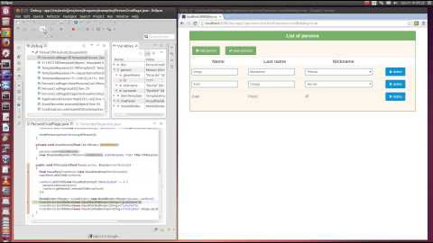

[](https://gitter.im/dragome-sdk?utm_source=badge&utm_medium=badge&utm_campaign=pr-badge&utm_content=badge)

# What is Dragome?
Dragome is an open source tool for creating client side web applications in pure Java (JVM) language.  
Based on bytecode to javascript compilation, you can execute applications written in Java directly on browsers.  
You may use your favorite IDE, your favorite Java frameworks and tools because Dragome is totally transparent.  

----------

### See it in action: how Eclipse and Chrome interact on debug mode and production mode.
[](http://youtu.be/WyseTuRZkNk)

Also take a look at these [example applications](https://github.com/dragome/dragome-examples) 

----------

## Why Dragome
* Full Java stack web applications, code everything in Java (server side and client side). It will be transformed to javascript automatically.
* Fast GUI development using components, builders and two-way databinding, using similar AngularJs concepts.
* Debug mode for debugging in your favorite Java IDE.
* No IDE plugins or browser plugins required.
* Java 8 ready. Build your pages using lambda expressions, default methods, streams
* You can use [Dynamic Proxies][2] and [Java Reflection API][3]
* Get rid of callbacks hell: Make async calls with no callbacks! How? See [Callback Evictor][4] Tool!
* Use continuation in your development: you can pause your resulting js program and continue it whenever you need.
* Unit testing integration: you can also run your Junit tests on a browser.
* Javascript native interface for low level component construction.
* Very powerful template engine. No logic in HTML files, only ids for locating templates placeholders.
* ... more at [Features][5]


Also see [Dragome Todos](doc/todos.md) for more info about the future

----------

## Dragome SDK modules
Dragome SDK can be divided into following six major parts:

* **Bytecode to JavaScript compiler** : Dragome compiler is used to translate all the application code written in Java into JavaScript. Within compilation process there is a bytecode instrumentation chain that could be configured to add your custom manipulations. Examples of this configuration are CallbackEvictor and MethodLogger plugins, which add javaflow enhancer and custom ASM enhancer to achieve each functionality.
* **JRE Emulation library** : Dragome includes a library that emulates a subset of the Java runtime library. Including metaprogramming tools such as reflection and dynamic proxies.
* **GUI Toolkit**: The toolkit contains a set of visual basic components such as: Button, Label, Checkbox, Radiobutton, List, Combo, Panel, etc. These components works together with a template engine capable of locating them into HTML logicless templates. Components and template engine are totally decoupled from HTML and css, allowing the addition of other UI targets such as Android, IOS, wxWidgets, etc in a near future.
* **Form Bindings**: Based on gwt-pectin project this module provides easy data bindings capabilities. It uses a declarative style API (guice style) for defining the models, commands and forms as well as binding them to components. In addition to gwt-pectin classes there is a small layer named "component builder" that helps to create components and binding with less effort.
* **Callback evictor**: In charge of getting rid of callback hell, it uses bytecode instrumentation and dynamic proxies to do it.
* **Method logger**: Simple method interceptor for automatic model changes detection, it also make use of bytecode instrumentations. It's commonly used by component builder layer to detects model changes in two-ways databinding.

### Execution modes
Dragome provides two execution modes, production mode for executing everything in client side, and debug mode that executes all in Java Virtual Machine without compiling to javascript and make remotes updates to browser DOM. 

----------
SDKs comparison


| Features  |Dragome|GWT|
|:---------|:-----------------------|:----|
| Generates js from | bytecode (produced by several JVM languages) | java source code
| Requirements for debug | Any modern browser, no plugin required for IDE or browser | IDE plugin and Browser plugin, not available for all browsers
| JDK changes impact | Almost no impact because bytecode rarely changes | Big impact in every new JDK version because java syntax changes frequently
| Incremental compiler | yes | -
| Java 8 | Lambda expressions, Stream API, default methods, and static interface methods available | not supported
| Continuation | yes (through javaflow) | -
| Reflection | yes | -
| Dynamic Proxies | yes | -
| Bytecode instrumentation | yes | -
| DOM level debug | yes | -
| Code permutations | - | yes
| Split compiling | - | yes
| Template Engine | yes | - 
| Two-way databinding for UI | yes | -
| Make async calls with no callbacks | yes | -
| Decouple from HTML/CSS using abstractions | yes | -


----------

[Learn how to bind components in Dragome in 5'][1]

----------

###Start working with Dragome
#### Using maven archetype
```shell
mvn archetype:generate -DarchetypeGroupId=com.dragome -DarchetypeArtifactId=simple-webapp-archetype -DarchetypeVersion=1.0 -DgroupId={your-package-name} -DartifactId={your-app-name}
```
----------

#### Using maven dependency in your project
``` xml
<dependency>
  <groupId>com.dragome</groupId>
  <artifactId>dragome-sdk</artifactId>
  <version>0.95.1-beta1</version>
  <type>pom</type>
</dependency>
```
----------

#### Clone and build
[How to build the SDK][6]

----------

#### Setup example application
[Setup your application](doc/app-setup.md)

----------

###How is programming web apps with Dragome?
**pure Java, pure HTML, runs as js inside browser!**


### Debug your application in Java with your favorite IDE
[](http://youtu.be/ktlMWKNVhgo)


----------

### Want to contribute?

* Fork the project on Github.
* Create an issue or fix one from the [issues list](https://github.com/dragome/dragome-sdk/issues).
* Share your ideas or ask questions on mailing list - don't hesitate to write a reply - that helps us improve javadocs/FAQ.
* If you miss a particular feature - browse or ask on the [mailing list](https://groups.google.com/d/forum/dragome) - don't hesitate to write a reply, show us a sample code and describe the problem.
* Write a blog post about how you use or extend Dragome.
* Please suggest changes to javadoc/exception messages when you find something unclear.
* If you have problems with documentation, find it non intuitive or hard to follow - let us know about it, we'll try to make it better according to your suggestions. Any constructive critique is greatly appreciated. Don't forget that this is an open source project developed and documented in spare time.

----------

###Take a look at the following source code:

This is the complete source code for a simple hello world application using a service. 

For more details see [Hello World Application][7]

**Service definition**
``` Java
public interface HelloWorldService
{
	public abstract String getGreetingsFor(String name);
}
```

**Service implementation**
``` Java
public class HelloWolrdServiceImpl implements HelloWorldService
{
	public String getGreetingsFor(String name)
	{
		return "Hello " + name + "! (" + new Date() + ")";
	}
}
```

**Service consumer - GUI**
``` Java
public class HelloWorldPage extends DragomeVisualActivity
{
	HelloWorldService helloWorldService= serviceFactory.createSyncService(HelloWorldService.class);

	public void build()
	{
		final VisualLabel<String> label= new VisualLabelImpl<String>("message");
		final VisualButton button= new VisualButtonImpl("button", v -> label.setValue(helloWorldService.getGreetingsFor("World")));
		mainPanel.addChild(label);
		mainPanel.addChild(button);
	}
}
```

**HTML**
``` Html
<html>
<head>
<script type="text/javascript" src="dragome/dragome.js"></script>
</head>

<body>
	Message: <b data-template="message">text</b> <br>
	<button data-template="button">Say hello!</button>
</body>

</html>
```


  [1]: doc/simple-examples.md#DRAGOME%205'%20TUTORIAL
  [2]: http://docs.oracle.com/javase/7/docs/api/java/lang/reflect/Proxy.html
  [3]: http://docs.oracle.com/javase/tutorial/reflect/
  [4]: doc/callback-evictor.md
  [5]: doc/features.md
  [6]: doc/how-to-build.md
  [7]: doc/helloworld-app.md
