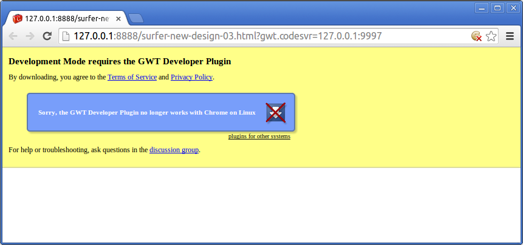

#Setup

There are no text configuration files in Dragome, everything is managed by some annotations and extending some classes for configuring for example which plugins are enabled.

##Available annotations:

### Type of compiler at class level or method level
@DragomeCompilerSettings(CompilerType.Strict (or) CompilerType.Standard)

### Page alias 

@PageAlias(alias= "{page-name}")

see [hello world example](helloworld-app.md) for more info


### To specify which class implements a service interface

@ServiceImplementation(ConcreteServiceImpl.class)
see [Services](services.md) for more info


##For configuring the entire application:


If you want to configure both CallbackEvictor and MethodLogger at the same time you may use this kind of configuration:

``` Java
@DragomeConfiguratorImplementor
public class ExamplesApplicationConfigurator extends ChainedInstrumentationDragomeConfigurator
{
	private CallbackEvictorConfigurator callbackEvictorConfigurator;
	private MethodLoggerConfigurator methodLoggerConfigurator;

	public ExamplesApplicationConfigurator()
	{
		callbackEvictorConfigurator= new CallbackEvictorConfigurator();
		callbackEvictorConfigurator.setEnabled(true);

		methodLoggerConfigurator= new MethodLoggerConfigurator(Person.class.getName());
		methodLoggerConfigurator.setEnabled(true);

		init(callbackEvictorConfigurator, methodLoggerConfigurator);
	}

	public ExecutionHandler getExecutionHandler()
	{
		return callbackEvictorConfigurator.isEnabled() ? callbackEvictorConfigurator.getExecutionHandler() : super.getExecutionHandler();
	}
}
```

You can add bytecode instrumentation configurators using init method. This configurator will make a chain of instrumentations in the order you specify calling init method. Also you may specify from which configurator you take executionHandler so you can disable continuations from there for debugging purposes for example.


## For IDEs and Browsers

Debug capabilities are working only in Chrome browser at current version. Other browsers will be supported in near future.


There is no installation required, neither browser or IDE plugin required.

Avoiding these sad problems...




