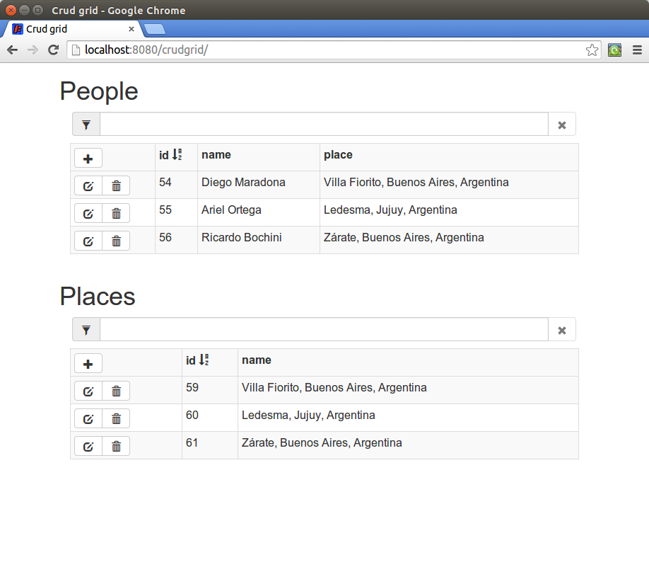

# Creating entity CRUD grid with Dragome SDK

##What is Dragome?

[Dragome][1] is a software development kit (SDK) for creating RICH Internet Application(RIA). It provides developers a mechanism to write client side application in Java. 

Javascript code is generated directly from bytecode which gives a lot of advantages in comparison to source to source transformations.

Dragome is open source, completely free, and it is licensed under the GPL v3.0.

## Why use the Dragome SDK?
* Code everything in Java (server side and client side), it will be transformed to javascript automatically.
* Higher level of abstraction for GUI development using components.
* High performance for generated client side code.
* Java based development process and code reuse.
* Use the excellent debugging support offered by the mature Java IDEs like Eclipse, developers can debug the client side application just as an Java Application.
* Make use of built-in IDE support to refactor Java code, improve your agile development.
* You will minimize contact with HTML files. Managed by graphics designers not developers, Dragome uses exactly the same files that designers are editing, just plain HTML files.
* UI design updates can be deployed by non developer roles because code is totally decoupled from HTML files.
* Use continuation in your development: you can pause your program and continue it whenever you need.
* Unit testing integration: you can also run your Junit tests on a browser.

## Dragome SDK modules
Dragome SDK can be divided into following five major parts:

* Dragome Bytecode to JavaScript compiler : This is the most important part of Dragome which makes it a powerful tool for building RIAs. Dragome compiler is used to translate all the application code written in Java into JavaScript.
* JRE Emulation library : Dragome includes a library that emulates a subset of the Java runtime library. 
* Form Bindings: Based on gwt-pectin project this module provides easy data bindings capabilities. It uses a declarative style API (guice style) for defining the models, commands and forms as well as binding them to components.
* Callback evictor: In charge of getting rid of callback hell, it uses bytecode instrumentation and dynamic proxies to do it.
* Method logger: Simple method interceptor for automatic model changes detection, it also make use of bytecode instrumentations.

Dragome provides two execution modes, production mode for executing everything in client side, and debug mode that executes all in Java Virtual Machine without compiling to javascript and make remotes updates to browser DOM. 

## System Requirements
* JDK	1.7 or above.
* Memory no minimum requirement.
* Disk space no minimum requirement.
* Operating System no minimum requirement.
* __Important note about debugging__: it is not required the use of any plugin for your IDE or for your browser (any modern Chrome version by now, and any version of Firefox soon, Safari and IE in future versions)

# Crud Grid example
This example is based on [AngularJS CRUD Grid with WebApi, EF, Bootstrap, Font Awesome & Toastr][2]. See original demo [here][3].



## Server-side code
There is only one class in server side, this is the implementation of our service that provides instances of required entities as well as metadata for UI creation.
It handles interactions to ORM by EntityManager, such as finding, removing, saving and updating entities.
Also it provides metadata for both entities Place and People.
See how to use services [here][4].

## Client-side code
All the remaining code is going to be executed at client side, this java code will be transformed to javascript and will be loaded by the browser in order to: create UI, manipulate entities instances, serialize/deserialize data structures, establish communication to server, etc.

Our first setup is about creating a **CrudGrid** instance, that's the main model we are going to use, passing it which entity we want it to show. Then for start building all components we will use a **ComponentBuilder** constructed with current **VisualPanel**, where all components and subcomponents will be hanging on.
To see how to use templates take a look at [Template Engine][5].

``` Java
CrudGrid crudGrid= new CrudGrid(entityType);
ComponentBuilder componentBuilder= new ComponentBuilder(this);
```

###Filter section
First section we are constructing is filter panel. Textfield is binded to "**filter**" property of **crudGrid** instance using **toProperty** method, we've previously chosen **VisualTextField** component to represent this value in view.
In "**remove-filter**" case we also add a condition to make it disable when desired expression is satisfied. For cleaning purposes we attached a click listener to set filter string to empty value.
``` Java
private void buildFilter()
{
    componentBuilder.bindTemplate("filter")
        .as(VisualTextField.class)
        .toProperty(crudGrid::getFilter, crudGrid::setFilter)
        .build();

    componentBuilder.bindTemplate("remove-filter")
        .as(VisualLabel.class)
        .disableWhen(() -> crudGrid.getFilter().length() == 0)
        .onClick(v -> crudGrid.setFilter(""))
        .build();
}
```

###Header
For "**add-mode-toggler**" we also add a condition but in this case for styling purposes, each style provided will be applied whenever "**accordingTo**" boolean expression takes true or false value.
At this point we need to create each column header giving each one: sorting behavior, configured style, and a name. For repeating "**table-header**" template for each column in **crudGrid.getColumns()** we use "**repeat**" method. Repeat method will execute the passing block for each column, providing it with column instance and a inner builder.
``` Java
private void buildHeader()
{
    componentBuilder.bindTemplate("add-mode-toggler")
        .as(VisualLabel.class)
        .onClick(v -> crudGrid.toggleAddMode())
        .styleWith("glyphicon-minus", "glyphicon-plus")
        .accordingTo(() -> crudGrid.isAddMode())
        .build();


    componentBuilder.bindTemplate("table-header")
        .as(VisualPanel.class)
        .toList(crudGrid.getColumns())
        .repeat((column, builder) -> {
            builder.onClick(() -> crudGrid.setOrderColumn(column)).build();
            builder.styleWith(column.getStyleName()).when(() -> true);
        
            builder.bindTemplate("column-name")
                .as(VisualLabel.class)
                .to(() -> column.getName())
                .build();
        
            builder.bindTemplate("order-icon")
                .as(VisualLabel.class)
                .styleWith("glyphicon-sort-by-alphabet", "glyphicon-sort-by-alphabet-alt")
                .accordingTo(() -> crudGrid.getOrderColumn().getOrder().equals(Order.ASC))
                .showWhen(() -> crudGrid.getOrderColumn() == column)
                .build();
        });
}
```

###Add section

In this section we will introduce a new tool for selecting templates using some expression. We are also repeating each column but inside columns template we want to show a combobox or textfield depending on if it is a lookup value or not. **switchWith** method will collect the corresponding switch expression, inside **buildChildren** builder we may express default case using **switchDefaultCase**, or **switchCase** for specific value to be considered.

``` Java
private void buildAddSection()
{
    componentBuilder.bindTemplate("add-section")
        .as(VisualPanel.class)
        .showWhen(crudGrid::isAddMode)
        .buildChildren(childrenBuilder -> {

            childrenBuilder.bindTemplate("save-button")
                .as(VisualButton.class)
                .onClick(() -> crudGrid.addObject())
                .build();
    
            childrenBuilder.bindTemplate("remove-button")
                .as(VisualButton.class)
                .onClick(() -> crudGrid.toggleAddMode())
                .build();

            childrenBuilder.bindTemplate("columns")
                .as(VisualPanel.class)
                .toList(crudGrid.getColumns())
                .repeat((column, builder) -> {

                    builder.switchWith(() -> !column.isLookup()).buildChildren(columnBuilder -> {

                        columnBuilder.bindTemplate("input")
                            .switchDefaultCase((caseBuilder) -> 
                                caseBuilder
                                .as(VisualTextField.class)
                                .toProperty(() -> crudGrid.getItem().getObject(), column.getName())
                                .disableWhen(() -> column.isAutoincrement())
                                .build());

                        columnBuilder.bindTemplate("select")
                        .switchCase(() -> false, (caseBuilder) -> 
                            caseBuilder
                            .to(new VisualComboBoxImpl(crudGrid.getLookupData(column.getLookupEntityType())))
                            .toProperty(() -> crudGrid.getItem().getObject(), column.getName())
                            .showWhen(() -> column.isLookup())
                            .build());
                    });
            });
    });
}
```

###Objects section

Using the same mechanism from above to repeat columns we are repeating each item, which contains a reference to an entity inside. In this case we want repeat them in a particular order and filtering by a provided expression.
For **orderBy** method we specify a getter that allows repeater mechanism to obtain the value to compare to, and we also specify the ascending or descending order we want to use.
And for filter purposes we specify only a tester supplier to test each item whether it has to be shown or not.
``` Java
private void buildObjects()
{
    componentBuilder.bindTemplate("objects")
        .as(VisualPanel.class)
        .toListProperty(crudGrid::getItems)
        .orderBy(crudGrid.getColumnValueGetter(), () -> crudGrid.getOrderColumn().getOrder())
        .filter(crudGrid::getFilterTester)
        .repeat((item, itemBuilder) -> {
            buildToolbar(item, itemBuilder);
            buildColumns(item, itemBuilder);
        });
}
```

###Building toolbar
In this section we can see how complex components can be selected for switch cases, both cases return VisualPanels composed by VisualLabels inside.

``` Java
private void buildToolbar(Item item, ComponentBuilder itemBuilder)
{
    itemBuilder.bindTemplate("toolbar")
        .as(VisualPanel.class)
        .switchWith(() -> !item.isEditMode())
        .buildChildren(toolbarChildrenBuilder -> {
            
            toolbarChildrenBuilder.bindTemplate("view-mode")
                .switchDefaultCase((caseBuilder) -> {
                    return caseBuilder.as(VisualPanel.class).buildChildren(childrenBuilder -> {
                        childrenBuilder.bindTemplate("edit").as(VisualLabel.class).onClick(() -> crudGrid.toggleEditMode(item)).build();
                        childrenBuilder.bindTemplate("trash").as(VisualLabel.class).onClick(() -> crudGrid.deleteObject(item)).build();
                    }).build();
                });

            toolbarChildrenBuilder.bindTemplate("edit-mode")
                .switchCase(() -> false, (caseBuilder) -> {
                    return caseBuilder.as(VisualPanel.class).buildChildren(childrenBuilder -> {
                        childrenBuilder.bindTemplate("save").as(VisualLabel.class).onClick(() -> crudGrid.updateObject(item).toggleEditMode(item)).build();
                        childrenBuilder.bindTemplate("remove").as(VisualLabel.class).onClick(() -> crudGrid.toggleEditMode(item)).build();
                    }).build();
                });
        });
}
```

###Showing values

For showing all column values we need to repeat each one to access the particular value and decide how to show it. In this last part we can see the usage of nested switch/cases commands, at top level we use a switch for selecting editMode cases for inline editing the instance. The second switch is inside edit-mode case, we need to choose whether to show a textfield or combobox depending on lookup property of current column.

``` Java
private void buildColumns(Item item, ComponentBuilder itemBuilder)
{
    itemBuilder.bindTemplate("columns")
        .as(VisualPanel.class)
        .toList(crudGrid.getColumns())
        .repeat((column, columnBuilder) -> {

            columnBuilder
                .switchWith(() -> item.isEditMode())
                .buildChildren(columnChildrenBuilder -> {
                    buildViewMode(item, column, columnChildrenBuilder);
                    buildEditMode(item, column, columnChildrenBuilder);
                });
        });
}

private void buildEditMode(Item item, Column column, ComponentBuilder columnChildrenBuilder)
{
    columnChildrenBuilder.bindTemplate("edit-mode")
            .switchCase(() -> true, (caseBuilder) -> {
                return caseBuilder
                    .as(VisualPanel.class)
                    .switchWith(() -> !column.isLookup())
                    .buildChildren(viewModePanelBuilder -> {
                        viewModePanelBuilder.bindTemplate("input")
                            .switchDefaultCase((lookupCaseBuilder) -> 
                                lookupCaseBuilder
                                    .as(VisualTextField.class)
                                    .toProperty(item.getObject(), column.getName())
                                    .disableWhen(() -> column.isAutoincrement())
                                    .build());

                        viewModePanelBuilder.bindTemplate("select")
                            .switchCase(() -> false, (lookupCaseBuilder) -> 
                                lookupCaseBuilder
                                .to(new VisualComboBoxImpl<>(crudGrid.getLookupData(column.getLookupEntityType())))
                                .toProperty(item.getObject(), column.getName())
                                .disableWhen(() -> column.isAutoincrement())
                                .build());
                    }).build();
            });
}

private void buildViewMode(Item item, Column column, ComponentBuilder columnChildrenBuilder)
{
    columnChildrenBuilder.bindTemplate("view-mode")
        .switchDefaultCase((caseBuilder) -> {
            return caseBuilder
                .as(VisualPanel.class)
                .onClick(() -> crudGrid.toggleEditMode(item))
                .switchWith(() -> column.isLookup())
                .buildChildren(editModePanelBuilder -> {
                    editModePanelBuilder.bindTemplate("not-lookup")
                    .switchDefaultCase((lookupCaseBuilder) -> 
                        lookupCaseBuilder
                            .as(VisualLabel.class)
                            .toProperty(item.getObject(), column.getName())
                            .build());

                    editModePanelBuilder.bindTemplate("lookup")
                        .switchCase(() -> false, (lookupCaseBuilder) -> 
                            lookupCaseBuilder
                                .as(VisualLabel.class)
                                .toProperty(item.getObject(), column.getName())
                                .build());
                }).build();
        });
}
```

###Main model 
The whole UI is interacting with a model called CrudGrid, this in charge of storing the information, perform actions over model, communication to server service, and provide some tools to help builders to create the UI.
This class is totally decouple from Dragome UI creation, builders, methodlogger plugin or any specific mechanism. The only point of coupling is about using ObservableList instances for detecting list changes automatically, but it could be considered framework agnostic because it only interacts with a listener inside.


``` Java
public class CrudGrid
{
    private boolean loading= true;
    private String filter= "";
    private boolean addMode;
    private List<Item> objects;
    private Item item;
    private List<Column> columns;
    private Tester<Item> filterTester= updateFilterTester();
    private Column orderColumn;
    private EntitiesProviderService entitiesProviderService= ServiceLocator.getInstance().getServiceFactory().createSyncService(EntitiesProviderService.class);
    private Class<?> entityType;

    public CrudGrid(Class<?> entityType)
    {
        this.entityType= entityType;
        List<Identifiable> all= entitiesProviderService.getAll((Class) entityType);
        List<Item> result= new ArrayList<Item>();
        for (Identifiable object : all)
            result.add(new ItemImpl(object));

        objects= new ObservableList<Item>(result);
        columns= new ObservableList<Column>(entitiesProviderService.getColumnsFor(entityType));

        item= initItem();
        orderColumn= columns.get(0);

        setLoading(false);
    }

    public void addObject()
    {
        getItems().add(item);
        Identifiable added= entitiesProviderService.add(item.getObject());
        item.getObject().setId(added.getId());
        toggleAddMode();
    }

    public void deleteObject(Item item)
    {
        objects.remove(item);
        entitiesProviderService.delete(item.getObject());
    }
...
```

### Complete template for CrudGridComponent
UI code is generally related to a HTML template containing nested elements with data-template attribute with the same name of bindTemplate usages. 
So you can see there is no coupling between templates and java code, except for those data-template attribute that mark where is each template and subtemplate.
There is no logic inside templates, they are pure HTML with no special tags and standard attribute usage. It make them interchangeable with other templates with the same specification (same nested data-templates in elements).
Graphic designers may work decoupled from developers in all development phases, UI design updates can be performed by any role cause there is no intervention from developers perspective required.

``` html
<body>
<div data-template="loading">Loading...</div>
<div class="input-group col-md-5 row filter">
    <span class="input-group-addon"><i class="glyphicon glyphicon-filter"></i></span>
    <input type="text" class="form-control" data-template="filter">
    <span class="input-group-addon btn btn-default" data-template="remove-filter"><i class="glyphicon glyphicon-remove"></i></span>
</div>

<table class="crud-grid table table-striped table-bordered table-condensed table-hover">
    <tr>
        <th class="col-md-1">
            <div class="btn-toolbar"><i class="btn btn-default glyphicon" data-template="add-mode-toggler"></i></div>
        </th>

        <th data-template="table-header">
            <div>
                <span data-template="column-name"></span>
                <i class="glyphicon" data-template="order-icon"></i>
            </div>
        </th>
    </tr>
    <tr data-template="add-section">
        <td>
            <div class="btn-toolbar">
                <div class="btn-group">
                    <i class="btn btn-default glyphicon glyphicon-save" data-template="save-button"></i>
                    <i class="btn btn-default glyphicon glyphicon-remove" data-template="remove-button"></i>
                </div>
            </div>
        </td>
        <td data-template="columns">
            <input class="form-control" data-template="input"/>
            <select data-template="select" class="form-control"></select>
        </td>
    </tr>
    <tr data-template="objects">
        <td>
            <div class="btn-toolbar" data-template="toolbar">
                <div class="btn-group" data-template="view-mode">
                    <i class="btn btn-default glyphicon glyphicon-edit" data-template="edit"></i>
                    <i class="btn btn-default glyphicon glyphicon-trash" data-template="trash"></i>
                </div>
                <div class="btn-group" data-template="edit-mode">
                    <i class="btn btn-default glyphicon glyphicon-save" data-template="save"></i>
                    <i class="btn btn-default glyphicon glyphicon-remove" data-template="remove"></i>
                </div>
            </div>
        </td>
        <td data-template="columns">
            <div data-template="view-mode">
                <span data-template="not-lookup"></span>
                <span data-template="lookup"></span>
            </div>

            <div data-template="edit-mode">
                <input class="form-control" data-template="input"/>
                <select data-template="select" class="form-control"></select>
            </div>
        </td>
    </tr>
</table>
</body>
```


  [1]: http://www.dragome.com/
  [2]: https://github.com/jonbgallant/AngularJS-WebApi-EF
  [3]: http://angularjs-webapi-crud-grid.azurewebsites.net/
  [4]: http://dragome.sourceforge.net/services.html
  [5]: http://dragome.sourceforge.net/template-engine.html
