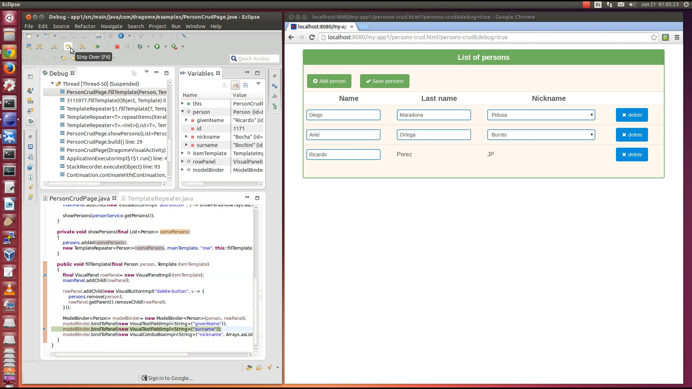

#Debugging in Dragome

One of the greatest features of Dragome is that you dont need to install anything to get it working.
When it's time for debugging your application you can use any IDE to make it, and it'll be exactly the same way you debug any other Java application.
Debugging is acchieved starting a browser/server communication via websockets, and transmiting data between both sides. 

__If you want to start debug mode just add, to the page url you are testing, the query string debug=true__

For example:

*http://localhost:8080/my-app1/persons-crud.html?persons-crud&debug=true*

