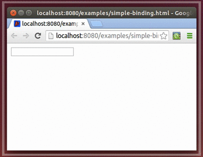
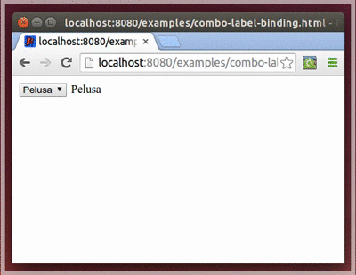
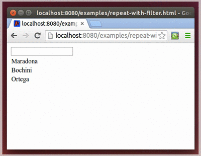
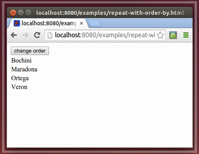

#Component building examples

### Textfield to label binding



First of all we create a ComponentBuilder using "mainPanel" component provided by DragomeVisualActivity. 
This panel is already configured with html body content, inside it we can find two placeholders with names "textfield" and "label". Both elements will be used to place our components that will be binding the same value.

``` html
<body>
	<input type="text" data-template="textfield" />
	<span data-template="label"></span>
</body>
```

As we can see in the following code we use bindTemplate to indicate in which placeholder will be placed the component. The next operation is calling "as" method to specify the component we want to instantiate to represent our data, in first case we create a VisualTextField for editing the desire property.
Finally we call toProperty method to configure getter and setter of the property we want to bind to the component.
Second case is almost the same concept but since label component is read only we just provide the getter for binding.

``` Java
@PageAlias(alias= "simple-binding")
public class SimpleBinding extends DragomeVisualActivity
{
	protected String text;
	
	public void build()
	{
		ComponentBuilder componentBuilder= new ComponentBuilder(mainPanel);

		componentBuilder.bindTemplate("textfield")
			.as(VisualTextField.class)
			.toProperty(this::getText, this::setText)
			.build();

		componentBuilder.bindTemplate("label")
    		.as(VisualLabel.class)
    		.toProperty(this::getText)
    		.build();
	}

	public String getText()
	{
		return text;
	}

	public void setText(String text)
	{
		this.text= text;
	}
}
```

------


### Combobox to label binding




Following the same concepts from above we create a combobox to label binding. 
HTML changes only in combobox element representation using a SELECT element.

``` html
<body>
	<select data-template="nickname"></select>
	<span data-template="text"></span>
</body>
```

We can see here that instead of declaring which kind of component we want to instantiate using "as" method, we create a new instance of VisualComboBoxImpl, configure it with supported values and give it to component builder using "to" method.  Component builder will use this preconfigured instance to represent the data, configuring the environment to show it in the right place.

``` Java
@PageAlias(alias= "combo-label-binding")
public class ComboLabelBinding extends DragomeVisualActivity
{
	protected String nickname;
	
	public void build()
	{
		ComponentBuilder componentBuilder= new ComponentBuilder(mainPanel);
		
		VisualComboBoxImpl<String> combo= new VisualComboBoxImpl<String>("nickname", Arrays.asList("Pelusa", "Burrito", "Bocha", "Bruja"));
		
		componentBuilder.bindTemplate("nickname")
			.to(combo)
			.toProperty(this::getNickname, this::setNickname)
			.build();
		
		componentBuilder.bindTemplate("text")
			.as(VisualLabel.class)
			.toProperty(this::getNickname, this::setNickname)
			.build();
	}

	public String getNickname()
	{
		return nickname;
	}

	public void setNickname(String nickname)
	{
		this.nickname= nickname;
	}
}
```

------


### Using repeaters


We have a list of names and we want to show them in a table, each one in a new row.
For doing this we use the following template with nested placeholders, "row" placeholder will be repeated for each item, and its content will be filled with corresponding item name.

``` html
<body>
	<table>
		<tr data-template="row">
			<td><span data-template="name"></span></td>
		</tr>
	</table>
</body>
```

We start binding "row" placeholder to a VisualPanel component. One instance of VisualComponent will be created for each item we provide in "names" list. 
Using "repeat" method we indicate we want to visit each item in provided list to build a panel for each one. This lambda expression receives the corresponding item and a builder that will help us to create the panel sub components. Inside it we create a label bound directly to the item.
 
``` Java 
@PageAlias(alias= "simple-repeater")
public class SimpleRepeater extends DragomeVisualActivity
{
	public void build() 
	{
		ComponentBuilder componentBuilder= new ComponentBuilder(mainPanel);

		List<String> names= Arrays.asList("Maradona", "Bochini", "Ortega");
		
		componentBuilder.bindTemplate("row")
    		.as(VisualPanel.class)
    		.toList(names)
    		.repeat((name, builder) -> {
    			
    			builder.bindTemplate("name")
    				.as(VisualLabel.class)
    				.to(() -> name)
    				.build();
    			
    		});
	}
}
```

------

### Filtering items




Now we want to show only the items that match the desire criteria.
For that we use a mix of previous components definitions, a VisualTextField for input filter criteria and a repeater for showing filtered items.
We add only the input placeholder for textfield component.

``` html
<body>

	<input type="text" data-template="input" />

	<table>
		<tr data-template="row">
			<td><span data-template="name"></span></td>
		</tr>
	</table>
	
</body>
```

Filter criteria will be stored in a class member called "filterText". This will be bound in two different places: to input component and also to the filter expression in repeater.
Repeater is configured the same way from above, but in this case we also call "filter" method giving it a supplier of a tester. This tester is using "startsWith" method for applying the criteria over a given item.
Note that we are using getFilterText method instead of a direct member access because we want the SDK to automatically detects changes over filterText value, and let it update the list view every time criteria takes another value.

``` Java 
@PageAlias(alias= "repeat-with-filter")
public class RepeatWithFilter extends DragomeVisualActivity
{
	String filterText= "";

	public void build()
	{
		ObservableList<String> names= new ObservableList<String>(Arrays.asList("Maradona", "Bochini", "Ortega"));

		ComponentBuilder componentBuilder= new ComponentBuilder(mainPanel);

		componentBuilder.bindTemplate("input")
			.as(VisualTextField.class)
			.toProperty(this::getFilterText, this::setFilterText)
			.build();
		
		componentBuilder.bindTemplate("row")
			.as(VisualPanel.class)
			.toList(names)
			.filter(() -> value -> value.startsWith(getFilterText()))
			.repeat((name, builder) -> {
				
				builder.bindTemplate("name")
    				.as(VisualLabel.class)
    				.to(() -> name)
    				.build();
			
		});
	}
	
	public String getFilterText()
	{
		return filterText;
	}

	public void setFilterText(String filterText)
	{
		this.filterText= filterText;
	}
}
```

------

### Sorting items




For sorting items in a repeater we add a button that will swap the current order between ASC and DESC.

``` html
<body>

	<button data-template="input" >change order</button>

	<table>
		<tr data-template="row">
			<td><span data-template="name"></span></td>
		</tr>
	</table>
	
</body>
```

Current order is stored in a class member, this will be updated each time the button is clicked.
For calling "orderBy" method we provide a comparable as first argument (we returned the same value because String is a Comparable),  and Order provider as second parameter. The same rule is applied for order member access, we want to detect its changes automatically so we must use getter to access this value.

``` Java 
@PageAlias(alias= "repeat-with-order-by")
public class RepeatWithOrderBy extends DragomeVisualActivity
{
	protected Order order= Order.ASC;

	public void build()
	{
		ComponentBuilder componentBuilder= new ComponentBuilder(mainPanel);

		componentBuilder.bindTemplate("input")
    		.as(VisualButton.class)
    		.onClick(() -> setOrder(getOrder().swap()))
    		.build();

		ObservableList<String> names= new ObservableList<String>(Arrays.asList("Maradona", "Bochini", "Ortega", "Veron"));
		
		componentBuilder.bindTemplate("row")
    		.as(VisualPanel.class)
    		.toList(names)
    		.orderBy(s -> s, () -> getOrder())
    		.repeat((name, builder) -> {
    			builder.bindTemplate("name")
        			.as(VisualLabel.class)
        			.to(() -> name)
        			.build();
    		});
	}

	public Order getOrder()
	{
		return order;
	}

	public void setOrder(Order order)
	{
		this.order= order;
	}
}
```
